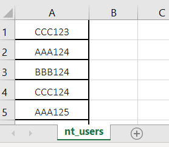
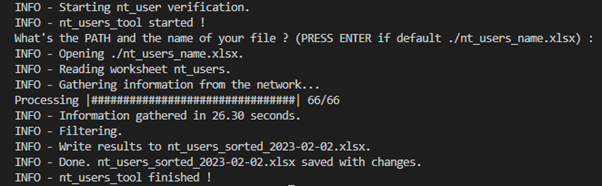
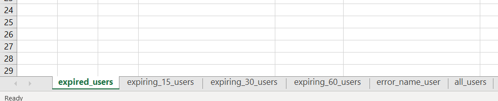

# nt-users-tool

Simple tool to easily manage NT users' expiration date

# Requirements
    - Python between 3.8 and 3.10
    - poetry installed  (https://python-poetry.org/docs/)

# How to use it?

Create a .xlsx file (by default we can use nt_users_name.xlsx) in the  main folder, with a sheet named "nt_users", with the first column composed of the list of the different user ID to test.

Start the executable nt_users_tool.exe to run the tool.

A terminal will open, and then write the path and the name of your .xlsx file (Or press ENTER if you use nt_users_name.xlsx).

If the tool run properly, you will probably receive the following logs :

Finally, a nt_users_sorted_[date].xlsx file is generated, with the users sorted by expiration date.

# Python project installation
### install requirements of the project
    $ poetry install
### add pre-commit files to git
    $ git add .\.pre-commit-config.yaml
### install pre-commit files
    $ pre-commit install
#### Think to start virtual env with
    $ poetry shell
#### Or always put "poetry run" before each command line

# Run the tool by .exe file
#### Put your .xlsx file in the same folder than nt_users_tool.exe and run
    $ .\nt_users_tool.exe
#### The sorted users are placed in the generated nt_users_sorted.xlsx file
#### You can use a command line to use a specific .xlsx file
    $ .\nt_users_tool.exe --filename=.\nt_users_name.xlsx

# Run the tool with python
#### Put your .xlsx file in the main folder (the folder with README.txt, config, src, tests, ect...) and run
    $ python .\src\nt_users_tool\cli.py
#### The sorted users are placed in the generated nt_users_sorted.xlsx file
#### You can use a command line to use a specific .xlsx file
    $ python .\src\nt_users_tool\cli.py --filename=.\nt_users_name.xlsx

# Unit Test
### Run unit test
    $ pytest -v -s

# Generate .exe file
#### in the main folder, run
    $ python .\make_exe.py
#### Now you can find in the main folder, nt_users_tool.exe
